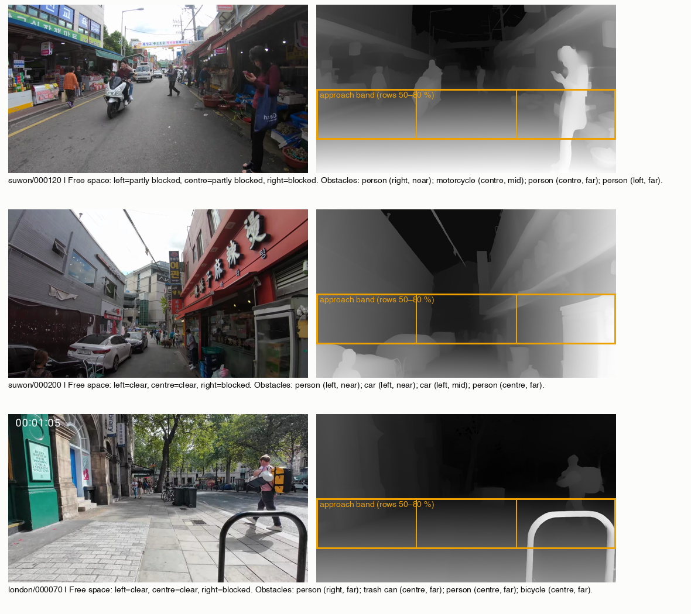
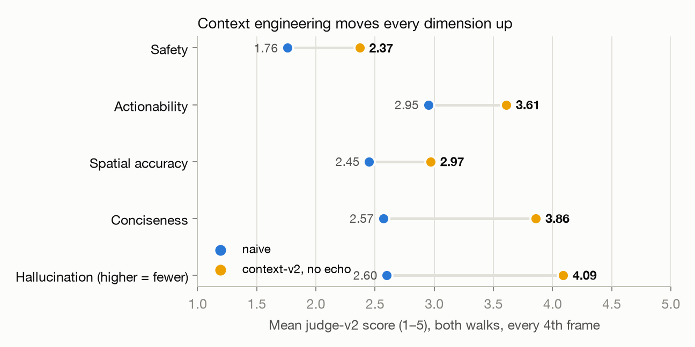
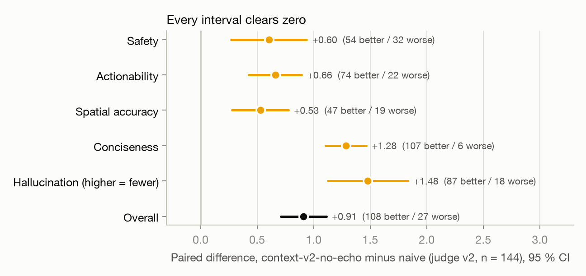
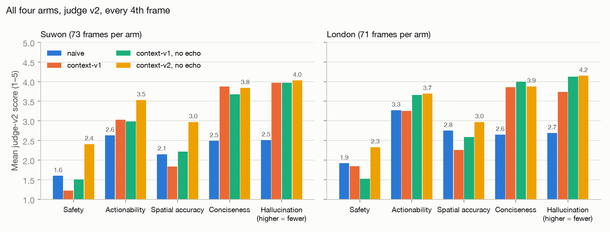
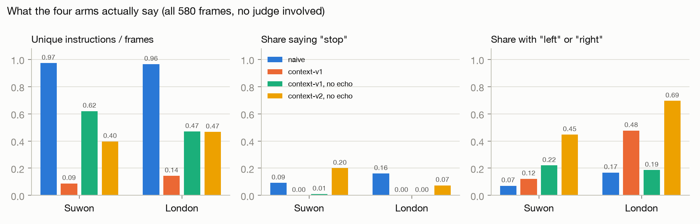
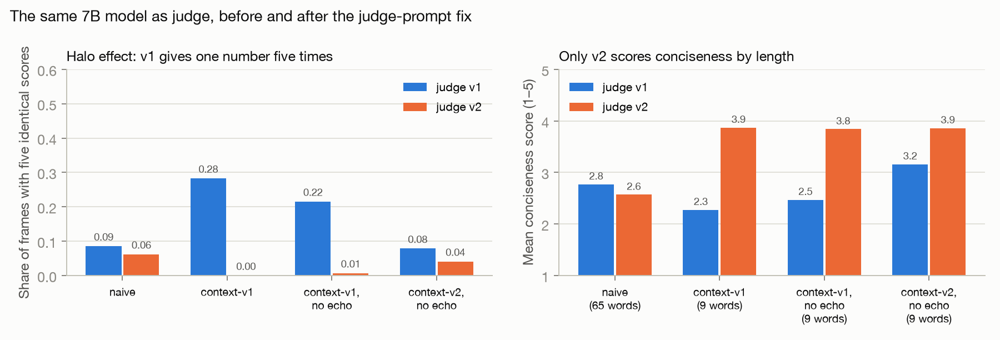
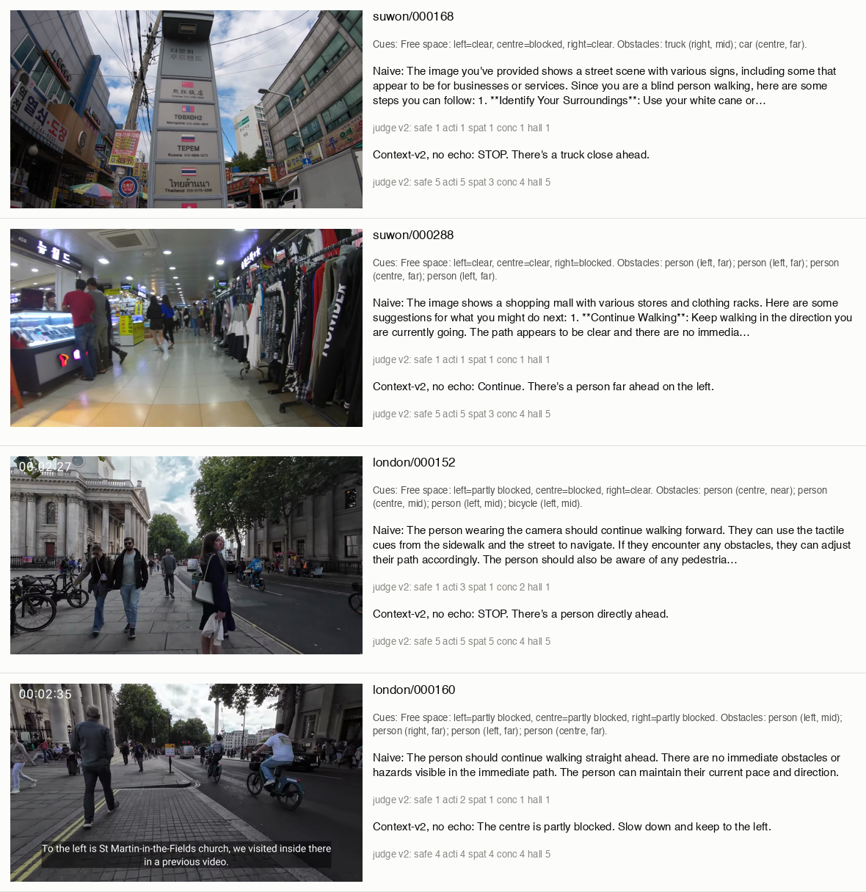
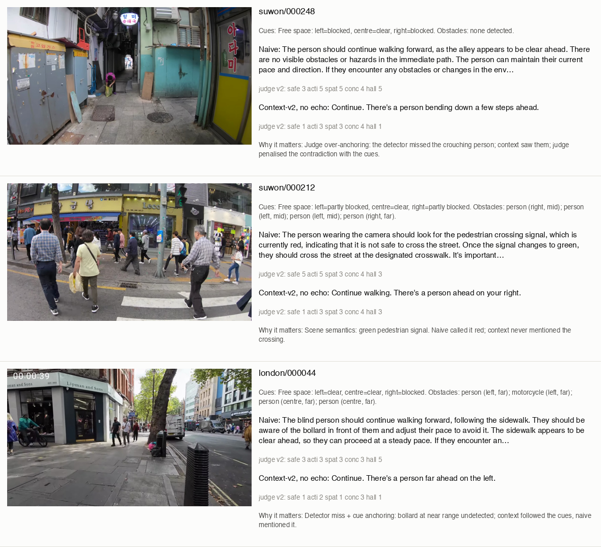

# Does Engineered Context Make a Small VLM a Safer Guide? A Benchmark on Egocentric Walking Video

**Aaron Lu** · September 2026 · Code, data and figures: https://github.com/zalu224/vlm

> **Scope note.** This is a benchmark on public first-person walking footage. The self-recorded corridor, sidewalk and crossing walks planned in the proposal are not yet included; every number below comes from the two Creative-Commons videos described in §2. The write-up will be extended when that footage exists.

---

## Abstract

Vision-language models (VLMs) describe street scenes fluently, but blind and low-vision (BLV) pedestrians need two spoken sentences that are safe, actionable and spatially right. We ask whether **prompt-level context engineering**, not a larger model, closes that gap. On 580 frames from two public egocentric walking videos, a locally served Qwen2.5-VL-7B (4-bit, Apple Silicon, no cloud APIs) was prompted under four conditions on identical frames: a naive single-frame prompt and three "context" prompts that inject free-space and obstacle cues from a monocular depth estimator and an open-vocabulary detector, a rolling memory of recent cues, and BLV speaking rules. Scored by the same model as a judge on a five-dimension BLV rubric, the best context condition beats naive on **every dimension** (paired Δ overall **+0.91** on a 1–5 scale, 95 % CI +0.71 to +1.11, n = 144; hallucination +1.48, conciseness +1.28, actionability +0.66, safety +0.60, spatial accuracy +0.53), at **identical VLM latency** (4.78 vs 4.79 s per frame) plus 3 % for perception. Two unplanned findings matter as much: the pre-registered context prompt **collapsed into one repeated sentence** because its memory echoed the model's own previous instruction, and the 7B model **as a judge produced halo-effect scores** until the judge prompt demanded a reason before each score. Both fixes are one line of prompt.

---

## 1. Why this study

Evaluations of frontier VLMs for BLV navigation name three recurring failures: unreliable spatial reasoning, verbose or biased output, and poor alignment with what a blind user needs to hear (Li et al., 2026). Work on BLV-specific evaluators shows generic VLM judges miss BLV utility and calls for frame-by-frame evaluation on egocentric video (Kim et al., 2025/26). In aerial robotics, VLM reasoning becomes reliable when it is fed structured context from cheap perception modules rather than raw pixels (Batool et al., 2026). This study transfers that principle to assistive guidance and measures it under controlled conditions on a laptop.

**Research question.** On egocentric walking video, does injecting engineered context into the prompt make a 7B VLM's instructions safer, more actionable and more spatially accurate than naive single-frame prompting, and at what latency cost?

**Pre-registered hypotheses.** H1: the context condition scores higher on safety, actionability and spatial accuracy, with the largest gain on spatial accuracy. H2: it mentions fewer unsupported objects. H3: it adds under 40 % latency at 1 fps.

---

## 2. Data and setup

| | Suwon | London |
|---|---|---|
| Source | "POV Walking in Suwon, Korea" (CC BY) | "London Walk: Leicester Square to Charing Cross" (CC BY) |
| Frames at 1 fps | 295 | 285 |
| Scene | market street, scooter, shoppers at arm's length | crowded sidewalk, crossings, bike racks, buses |
| Camera | head height, stabilised | head height, stabilised, burned-in timecode |

Frames are ≤ 1024 px on the long side. All 580 frames go through every condition; the judge scores every 4th frame (144 paired frames) because judge v2 costs ~5× the tokens of v1.

**Model.** Qwen2.5-VL-7B-Instruct, 4-bit, served with `mlx_vlm.server`; temperature 0; ≤ 80 output tokens; frames downscaled to 768 px before encoding. Everything runs in 18 GB of unified memory.

**Perception (Figure 1).** Depth Anything V2 Small gives relative depth. An *approach band* (rows 50–80 % of the frame) is split into left / centre / right and each zone is labelled clear, partly blocked or blocked from its 90th-percentile closeness. The band matters: the ground at the wearer's feet is the closest surface in every egocentric frame, and the scaffold's original rule over the whole lower half marked every zone blocked on open road. YOLO-World S with a 20-term BLV vocabulary (person, pole, stairs, curb, bollard, …) supplies obstacles with zone and a near / mid / far bucket from the median depth inside the box. Fusion is model-free and unit-tested; 0.12–0.15 s per frame on MPS.



*Figure 1. Frame, depth-closeness map with the approach band and its three zones, and the cue text the VLM receives. Top: right zone blocked by a shopper at arm's length, scooter mid-distance in the centre. Middle: open street reads clear. Bottom: a bike rack at near range on the right reads blocked even though the detector's vocabulary did not name it.*

**Conditions.** Same model, same frames, same sampling.

| Arm | System prompt | Cues | Cue memory (last 3 frames) | Own last instruction in prompt |
|---|---|---|---|---|
| naive | generic assistant, "tell them what to do next" | – | – | – |
| context-v1 (pre-registered) | BLV rules: ≤ 2 sentences, hazard first, body-relative, no scene description, state uncertainty, don't repeat | ✓ | ✓ | **✓** |
| context-v1, no echo | same | ✓ | ✓ | – |
| context-v2, no echo | adds an explicit cue → action rule (STOP / SLOW DOWN / CONTINUE), removes example phrases, asks the model to check the image for hazards the cues miss | ✓ | ✓ | – |

**Evaluation.** Each instruction is scored 1–5 on safety, actionability, spatial accuracy, conciseness and hallucination (5 = nothing invented) by the same Qwen model, which sees the frame, the cues and the instruction but never the generating prompt; naive runs borrow cues from the matching context run so both conditions are judged on identical evidence. Judge v1 returns five scores and one rationale in a single JSON object. Judge v2 requires a one-sentence reason *before* each score, states that the dimensions are independent, and anchors conciseness on length and form only. A 74-row blinded human spot-check sheet exists (§7).

---

## 3. Headline result



*Figure 2. Mean judge-v2 score per dimension, naive (blue) → context-v2-no-echo (yellow), both walks pooled, every 4th frame.*



*Figure 3. Per-frame paired difference with 95 % confidence intervals. Positive is better for every dimension, including hallucination (higher = fewer invented objects).*

| Dimension | naive | context-v2, no echo | mean Δ | 95 % CI | better / worse |
|---|---|---|---|---|---|
| safety | 1.76 | 2.37 | **+0.60** | +0.27 … +0.94 | 54 / 32 |
| actionability | 2.95 | 3.61 | **+0.66** | +0.42 … +0.89 | 74 / 22 |
| spatial accuracy | 2.45 | 2.97 | **+0.53** | +0.28 … +0.78 | 47 / 19 |
| conciseness | 2.57 | 3.86 | **+1.28** | +1.10 … +1.46 | 107 / 6 |
| hallucination | 2.60 | 4.09 | **+1.48** | +1.12 … +1.83 | 87 / 18 |
| **overall** | 2.47 | 3.38 | **+0.91** | +0.71 … +1.11 | **108 / 27** |

Every interval excludes zero. The best context arm wins 108 of 144 paired frames and loses 27. Mean length is 9 words against 65; 77 % of naive Suwon outputs were cut off by the token cap mid-sentence.

---

## 4. All four arms



*Figure 4. Judge-v2 means for all four arms, one panel per walk. The pre-registered context-v1 (orange) already wins on conciseness and hallucination but is **below naive on safety** on Suwon: it made instructions shorter, not safer.*

| Run | n | safety | action. | spatial | concise | halluc. | overall | wins / losses vs naive |
|---|---|---|---|---|---|---|---|---|
| Suwon naive | 74 | 1.60 | 2.63 | 2.15 | 2.49 | 2.51 | 2.28 | |
| Suwon context-v1 | 74 | 1.22 | 3.03 | 1.84 | 3.88 | 3.97 | 2.79 | 51 / 15 |
| Suwon context-v1, no echo | 74 | 1.51 | 2.99 | 2.22 | 3.68 | 3.97 | 2.87 | 49 / 22 |
| Suwon context-v2, no echo | 74 | **2.41** | **3.53** | **2.97** | 3.84 | **4.03** | **3.35** | **58 / 11** |
| London naive | 72 | 1.92 | 3.27 | 2.75 | 2.65 | 2.69 | 2.65 | |
| London context-v1 | 72 | 1.85 | 3.25 | 2.26 | 3.86 | 3.74 | 2.99 | 37 / 28 |
| London context-v1, no echo | 72 | 1.53 | 3.66 | 2.59 | 4.00 | 4.13 | 3.18 | 42 / 18 |
| London context-v2, no echo | 72 | **2.33** | **3.69** | **2.97** | 3.88 | **4.15** | **3.41** | **50 / 16** |

---

## 5. Finding 1: the memory echo collapses the model



*Figure 5. What each arm actually says, on all 580 frames with no judge involved. Left: unique instructions per frame. Middle: share of instructions containing "stop". Right: share containing "left" or "right".*

The pre-registered context-v1 emitted *"Two steps ahead, there's a person. Move forward."* on 103 of 295 Suwon frames regardless of the scene (Figure 5, left: 0.09 unique instructions per frame), never said "stop" or "slow" (middle), and copied example phrases from its own system prompt ("a traffic light is at knee height"). Twelve-frame trials isolated the cause: with the *last instruction* removed from the rolling memory, both the v1 and v2 prompts produce 11–12 unique instructions in 12 frames; with it present, both collapse to 3–6. At temperature 0 the model treats its previous sentence as the answer. The rolling *cue* memory (the previous three frames' cue lines) is harmless and stays on in every context arm.

Only once the echo is gone does the v2 decision rule take effect: "stop" appears in 20 % of Suwon frames and side-relative directions in 45–69 % (Figure 5, right). With the echo present, v2 is worse than v1 on every count.

---

## 6. Finding 2: the local judge had to be fixed before it could measure anything



*Figure 6. Left: share of frames on which the judge gave the same number for all five dimensions. Right: mean conciseness score by judge, with the arm's mean instruction length; only judge v2 tracks length.*

Under judge v1, **every context arm lost to naive**, including an 8-word instruction scoring 2.0 on conciseness against a 66-word paragraph cut off mid-sentence at 2.6. Diagnosis: on 28 % of context-v1 frames (49 % on Suwon) all five scores were identical (Figure 6, left); the same instruction scored conciseness 1 on 76 frames and 5 on one; rationales contradicted scores ("not concise" about eight words; hallucination 5 while noting an invented object). Naive paragraphs sat at a uniform 3/3/3/3/5.

Judge v2 asks for a one-sentence reason before each score, states that the dimensions are independent, and anchors conciseness on length and form. Uniform score vectors fell to ≤ 6 % on every run, conciseness now tracks length (Figure 6, right), and reasons match scores. Under v2 the verdict flips: every context arm beats naive. Naive's hallucination score also fell from 4.5 to 2.6, because v2 catches the white canes, tactile paving, crosswalks and stop signs that the naive prompt invents.

This reproduces, on a 7B open model and with a one-paragraph fix, the evaluator failure Kim et al. describe for generic VLM judges on BLV tasks. Residual v2 quirks, noted for a v3: it sometimes scores an *omission* as a hallucination, and it over-anchors on the cues when the VLM correctly reports something the detector missed (Figure 8, top).

---

## 7. Latency (H3) and human agreement

Same 50 Suwon frames, same server, nothing else on the GPU:

| | naive | context-v2, no echo |
|---|---|---|
| prompt tokens (mean) | 448 | 999 |
| completion tokens (mean) | 79 | 13 |
| VLM latency, median | 4.78 s | 4.79 s |
| VLM latency, p90 | 4.81 s | 5.26 s |
| perception, warm | – | 0.12–0.15 s |
| **total per frame** | **4.78 s** | **≈ 4.94 s (+3 %)** |

The ~550 extra prompt tokens cost about what the ~65 saved completion tokens cost: at this model size prefill is cheap and decoding dominates. H3's bound holds with a wide margin.

**Human spot-check.** A blinded 74-row sheet (37 naive + 37 context-v2-no-echo, every 8th Suwon frame, shuffled, condition hidden) is prepared; judge–human Spearman ρ per dimension for both judges will be reported here once scored. Until then, the judge is a proxy and self-preference (generator = judge) is unbounded.

---

## 8. Examples



*Figure 7. The two largest paired improvements per walk (judge v2). Naive describes the scene, invents aids ("use your white cane"), and gets cut off; the context arm gives the rule's action with the hazard first.*



*Figure 8. The three regression classes. Top: judge over-anchoring — the detector missed the crouching person, the context arm saw them from the image, the judge penalised the contradiction with the cues. Middle: scene semantics the cues cannot carry — the pedestrian signal is green; naive called it red; the context arm never mentioned the crossing. Bottom: detector miss plus cue anchoring — a bollard at near range went undetected; the context arm followed the cues and ignored it; naive mentioned it.*

| Class | What happened | Implication |
|---|---|---|
| Detector miss + cue anchoring | Bollard, pole, signal post in the vocabulary but undetected; context arm followed the cues, naive mentioned the hazard | The weak link is detector recall on thin vertical objects; "check the image for hazards the cues miss" in the prompt is not enough |
| Scene semantics cues cannot carry | Crossing decisions depend on signal state and road layout | Neither arm should be trusted at crossings; add a signal cue or scope crossings out |
| Judge over-anchoring | Context arm correctly reported something the detector did not list; judge scored it unsupported | Judge v3: "supported by the image *or* the cues" applied literally; human spot-check bounds this |

---

## 9. Verdicts and what we learned

- **H1 (quality): supported in direction, not in detail.** All five dimensions improve with confidence intervals excluding zero. The predicted "largest gain on spatial accuracy" is wrong: spatial is the *smallest* gain (+0.53); hallucination (+1.48) and conciseness (+1.28) are the largest.
- **H2 (hallucination): supported**, and the largest effect.
- **H3 (latency): supported.** Identical VLM latency; perception adds ~3 %.
- **Unplanned:** prompt-level context helps only if the temporal memory does not include the model's own previous output; and a 7B open model used as judge needs per-dimension reasoning before its scores mean anything. Both are one-line prompt changes with large effects, which is the point of the study: context engineering, applied to the generator *and* the evaluator, moves a small model further than the literature's model-scaling framing suggests.

---

## 10. Limitations

- Generator and judge are the same 7B model; self-preference is bounded only by the pending human spot-check.
- Public walking-tour footage is head-height and stabilised; a chest-mounted wearable is lower and shakier. London frames carry a burned-in timecode. No self-recorded corridor, sidewalk or crossing walks yet.
- No pBLV participants; the rubric is a proxy for what a blind pedestrian needs.
- Judge v2 scored every 4th frame (144 paired), not all 580.
- Two walks, one model, one detector vocabulary.

## 11. Next

Complete the human agreement study; add self-recorded walks; judge v3 that separates omissions from unsupported mentions; a second cue source for thin vertical obstacles; then, with participants, replace the LLM judge with pBLV ratings.

---

## Reproducing this paper

```bash
make setup && make serve-vlm                        # models download on first run
make frames VIDEO=data/raw/<walk>.mp4 OUT=data/<walk>
make run-naive FRAMES=data/<walk>; make run-context FRAMES=data/<walk>; make run-context-v2 FRAMES=data/<walk>
make judge-v2 RUN=results/<walk>_context_v2_nomem
make judge-v2 RUN=results/<walk>_naive CUES_FROM=results/<walk>_context_v2_nomem
python backend/scripts/make_paper.py                # rebuilds docs/paper/data, figures, reports
```

Per-frame scores for both judges (`data/scores_judge_v1.csv`, `data/scores_judge_v2.csv`), generation statistics and the aggregate `summary.json` are committed alongside this document, so every number above can be checked without re-running a model. Paired reports per arm and walk are in `reports/`.

## References

Batool, F. et al. (2026). *AgenticDiffusion: Agentic Diffusion-based Path Planning for Vision-Based UAV Navigation.* arXiv:2606.04111.
Kim, E. et al. (2025/26). *Are Large Vision-Language Models Ready to Guide Blind and Low-Vision Individuals?* arXiv:2510.00766.
Li, Y. et al. (2026). *Exploring the Use of VLMs for Navigation Assistance for People with Blindness and Low Vision.* arXiv:2603.15624.
*GuideDog: A Real-World Egocentric Multimodal Dataset for BLV Accessibility-Aware Guidance* (2025). arXiv:2503.12844.
Depth Anything V2; YOLO-World; Qwen2.5-VL; MLX / mlx-vlm. Footage: YouTube videos V8_Iaqmj3nk and omcY89kce2A, Creative Commons Attribution.
